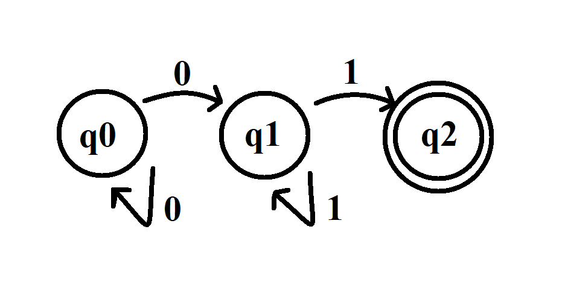
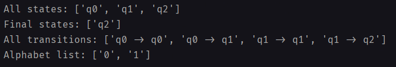

# LFTC_Lab3

Statement: Write a program that reads the elements of a finite automaton from a file and:

Display set of states, alphabet, transitions, set of final states
Documentation should also include in BNF or EBNF format the form in which the FA.in file should be written
BONUS : Consider the input data corresponding to the lexical tokens of your programming language, verify if a given string is a valid lexical token.

## When we apply our rules this is written as:

{q0},0->{q0}
{q0},0->(q1)
(q1),1->(q1)
(q1),1->[q2]

